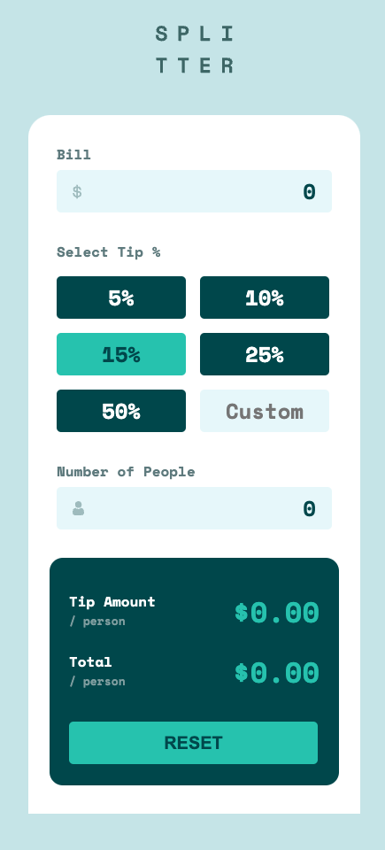
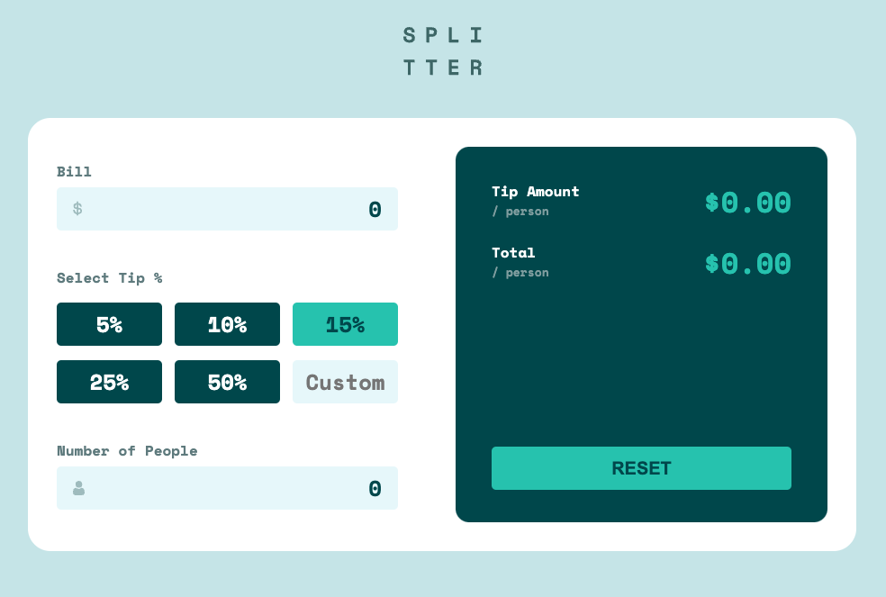

# Frontend Mentor - Tip calculator app solution

This is a solution to the [Tip calculator app challenge on Frontend Mentor](https://www.frontendmentor.io/challenges/tip-calculator-app-ugJNGbJUX). Frontend Mentor challenges help you improve your coding skills by building realistic projects. 

## Table of contents

- [Overview](#overview)
  - [Screenshot](#screenshot)
- [My process](#my-process)
  - [Built with](#built-with)
  - [What I learned](#what-i-learned)

## Overview

### Solution Screenshots

#### Mobile View

#### Desktop View

## My process

### Built with

- Mobile-first workflow
- Semantic HTML5 markup
- Flexbox

## My Solution Link
View Site: [Tip Calculator](https://vcollins1.github.io/tip-calculator/)